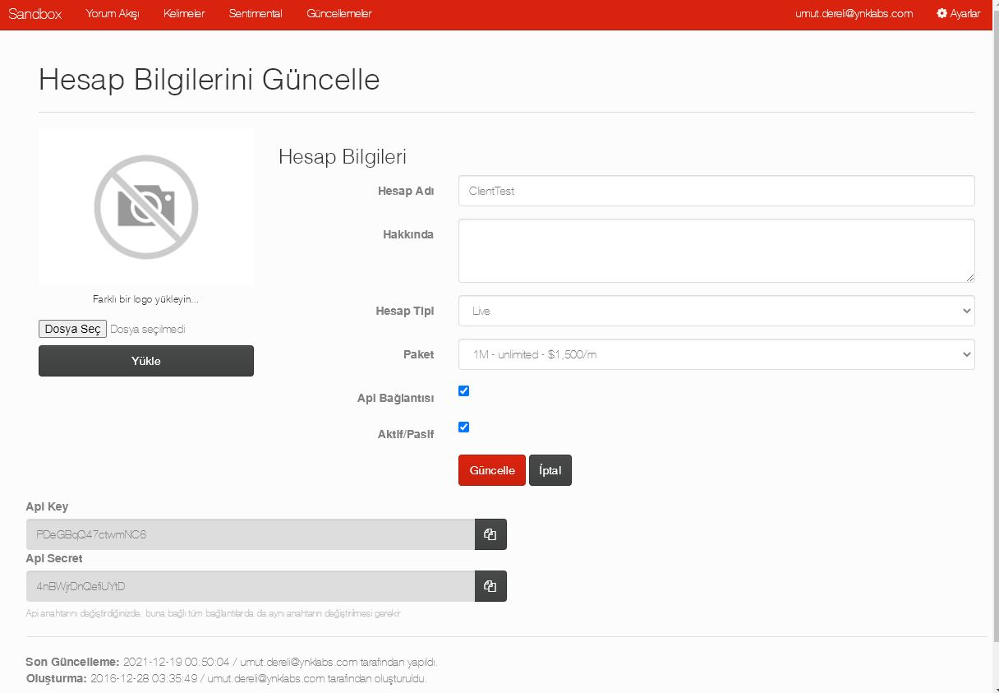
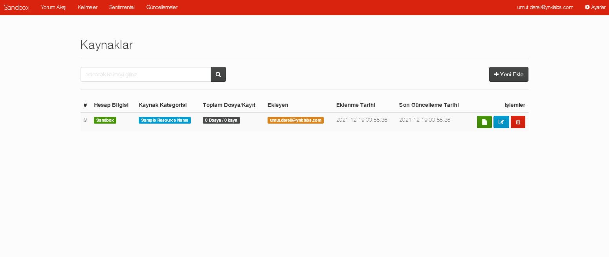

# Sentiment Analysis Using Naive Bayes and N-Gram SaaS Full with Laravel

This was a full completed SaaS project with Laravel from scratch which I developed about 7 years ago.

<i> -- Since this project is from a very old version, there may be some security issues. Please be careful.</i>

The main aim of this project was to provide Bayesian sentimental analysis as a service to the clients. 
Clients were able to configure different different bayesian (n-gram models with wizards) domains and could use it on different data sources. 
The service could be provided over Rest API or by client dashboards.

Main features are:

1- User Roles [Super Admin, Admin, Moderators]

2- Account Management [Pitching Accounts, Live accounts with different packages and limitations]

3- Multi users under client accounts and different type of permissions. (modules based)

4- Schedule Commands (7 days after checking pitching accounts , invoice calculations, retrieving data from social networks etc.)

5- Queue Management

6- AWS SQS, Google Vision API, Yandex Translate, Clarifia Logo Recognition, Brandwatch Query, Twitter API integrations.

7- Cache management

8- Invoices (depending on which module used and how many)

9- Rest API (enhanced throttle and rate limiting + invoicing relations)

10- Jquery single page application 

To run:

changing necessary API keys, API rate limits,costs, permission trees etc. all -> settings.php

other parts of the settings at -> config/app.php, config/database.php

For database creation:

php artisan migrate

php artisan db:deed //this will add first system user.

 

 

 

 

 

 

 

 

 

 

 

 

 

 

 

 

 

 

 

 

